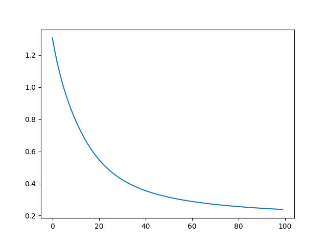
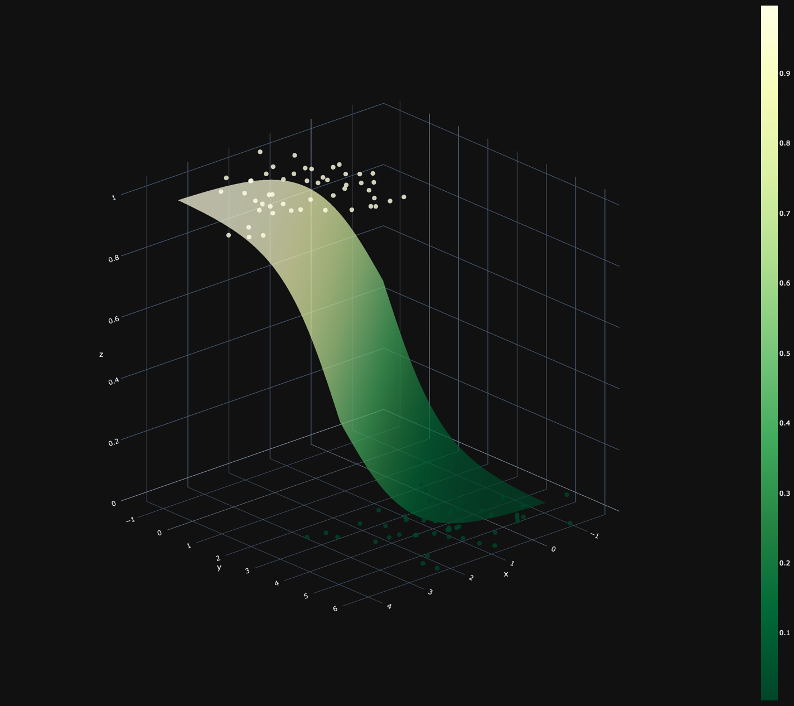
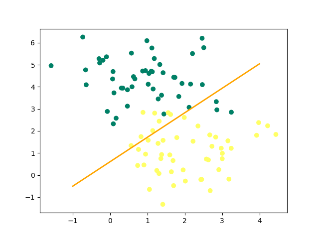

# Toxic-Plant-Deep-Learning

## Description

Python algorithm to determine whether a plant is toxic or not, using an artificial neuron and the gradient descent method.

## Result 

### Cost function

### 3D Graph

### 2D Graph
